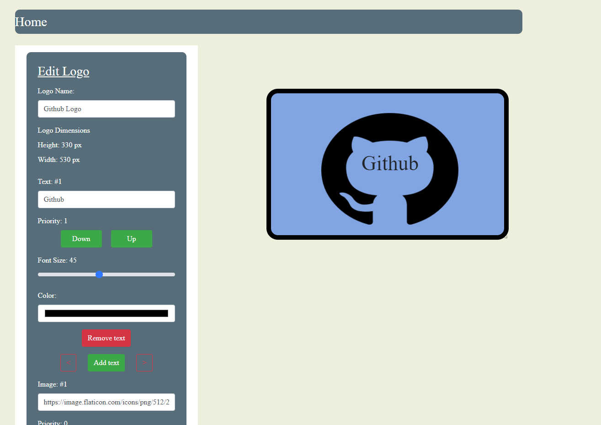

# Logo Maker

## Description

This is a MERN stack based web application that is used to make Logos

Note: make sure the server is running on port 3000 and the client on port 3001

## Features

- Add texts to a logo
- Add images to a logo
- Adjust the size of elements in the logo
- Move the elements of the logo around
- Adjust the overall size, color, border, and margins of the logo
- Save your logo's and edit them in the future
- Login with a google account so that your saved logo's will be tied to that account
- Download logo's that you've created
- View a list of all you saved logo's

## Setup

1. Clone the project
2. Install Express.js and Node.js if you do not have it installed
3. Install MongoDB if you do not have it installed
4. Create a MongoDB database for the application
5. Run "npm install" in the root folder, the client folder, and server folder
6. Run "npm start" in the server folder and client folder (Make sure the server is running on port 3000 and the client on port 3001)

## Examples

### Default Logo

### Custom Logo

### Home Screen

### Login Screen

